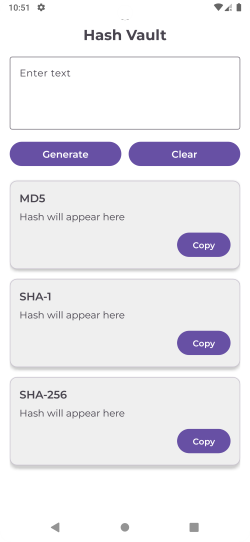
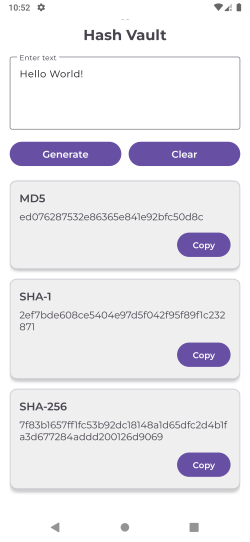

# 📱 Hash Vault

HashVault is a simple Android application that generates cryptographic hash values for user-entered text. The application supports MD5, SHA-1, and SHA-256 hashing algorithms using Java's built-in MessageDigest class, providing a fast and reliable way to compute hash digests.
The project follows the Model-View-ViewModel (MVVM) architecture to ensure a clean separation of concerns, making the codebase modular, maintainable, and easy to understand. The UI interacts with the ViewModel, which coordinates the hashing logic through the repository layer, while utility classes handle the cryptographic operations.

## ✨ Features

- Generate MD5, SHA-1, and SHA-256 hashes from text input. 
- Uses Java's MessageDigest API for secure hash generation. 
- Implements the MVVM architecture for better code organization. 
- Clean and simple user interface. 
- Lightweight and easy to extend with additional hashing algorithms

## 🛠️ Built With

- Java 
- MVVM Architecture 
- ViewModel 
- MessageDigest API 
- XML for UI design

## 📸 Screenshots

| Home Activity                    | After Generating Hash                     |
|----------------------------------|-------------------------------------------|
|  |  |

## 📂 Project Structure

```text
app
└── src
    └── main
        ├── java
        │   └── com.example.hashvault
        │       ├── model
        │       │   └── HashModel.java
        │       ├── repository
        │       │   └── HashRepository.java
        │       ├── viewmodel
        │       │   └── HashViewModel.java
        │       ├── ui
        │       │   └── MainActivity.java
        │       └── utils
        │           └── HashUtils.java
        │
        ├── res
        │   ├── layout
        │   │   └── activity_main.xml
        │   ├── values
        │   ├── drawable
        │   └── font
        │
        └── AndroidManifest.xml
```